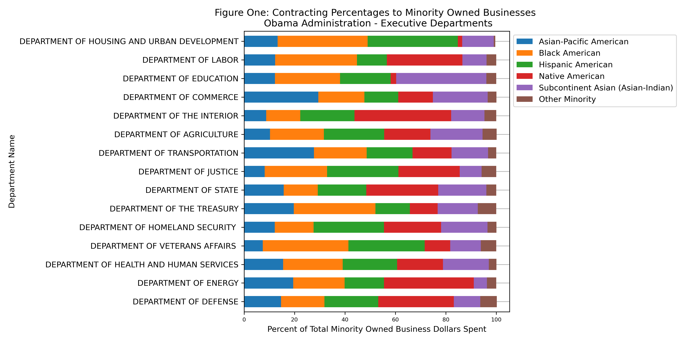
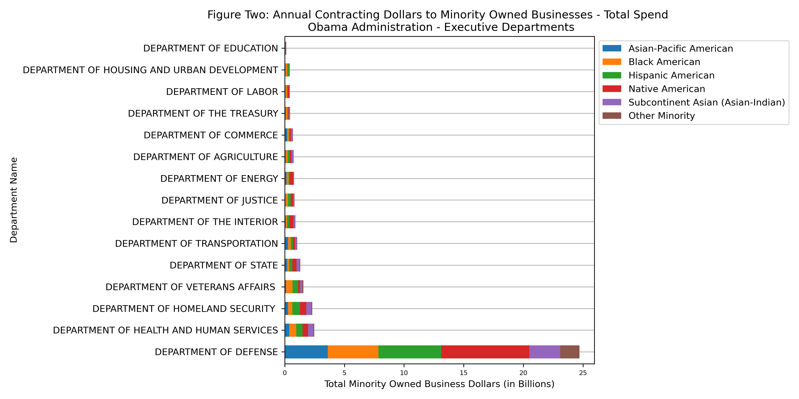
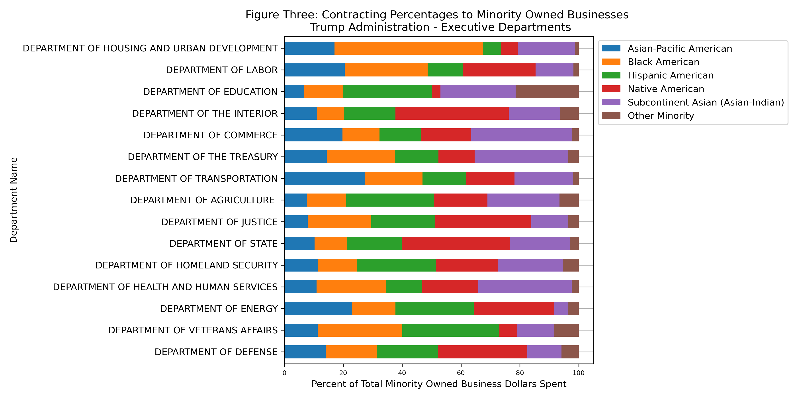
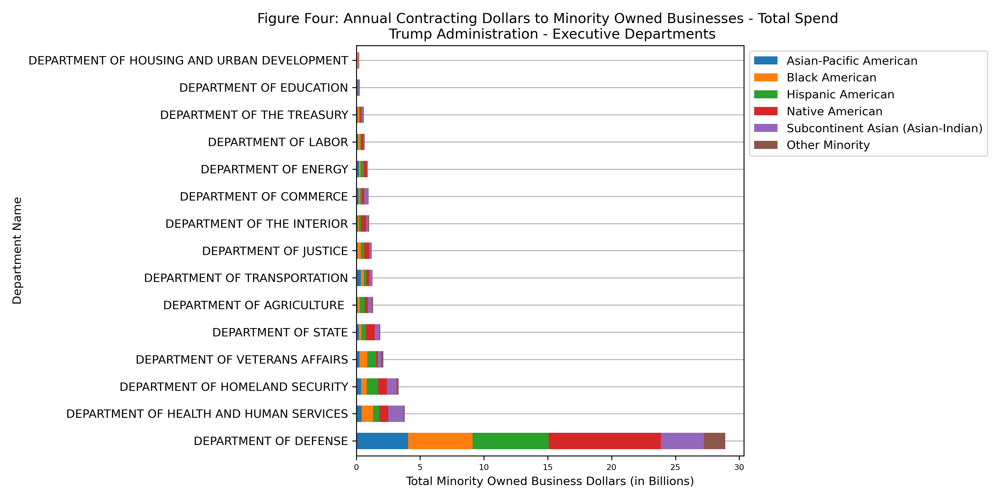
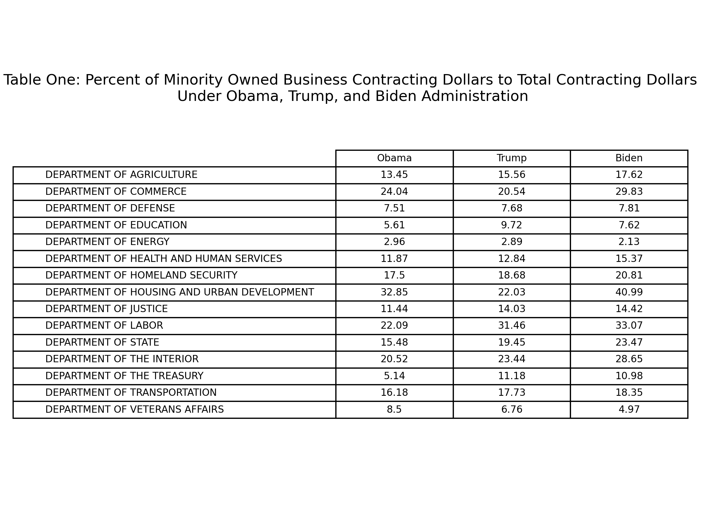

# Analysis of Minority-Owned Business Contracting Dollars Across U.S. Federal Departments

**Objectives**

The purpose of this study is to evaluate trends in minority-owned business contracting dollars across the Obama, Trump, and Biden presidential administrations. The analysis considers dollars spent across all executive federal agencies: Department of Agriculture, Department of Commerce, Department of Defense, Department of Education, Department of Energy, Department of Health and Human Services, Department of Homeland Security, Department of Housing and Urban Development, Department of Justice, Department of Labor, Department of State, Department of the Interior, Department of the Treasury, Department of Transportation, and the Department of Veterans Affairs.

**Background**

A [study](https://www.whitehouse.gov/omb/management/office-federal-procurement-policy/) done by the Office of Management and Budget approximates one out of every ten dollars of Federal government spending goes to contractors. The realm of government contracting and procurement is one that requires careful scrutiny given the amount taxpayer money that goes into play. Depending on the service or product required, participating businesses can receive up to millions of dollars in sales depending on the nature and longevity of the contract. For many firms, receiving a government contract could be a turning page in advancing their business, opening themselves up greater opportunities. Government contracting can be viewed as an important case study for public administrators. Every successful contract requires good governance practices, proper oversight, and relationship building between public and private stakeholders. 

There are also many equity considerations that go into contracting. Giving opportunities to small, minority-owned businesses can help leverage the financial advantage larger businesses have in the contracting space. Investing money into these businesses could help their growth in the long run while also investing in underrepresented communities. The Biden administration has recognized the importance of investing in minority-owned businesses as a means of helping narrow the racial wealth gap which exists in this country. This initiative to change the federal government’s procurement and contracting goals was introduced in one of the first few weeks of the administration. 

As stated in a [White House Briefing](https://www.whitehouse.gov/briefing-room/statements-releases/2021/06/01/fact-sheet-biden-harris-administration-announces-new-actions-to-build-black-wealth-and-narrow-the-racial-wealth-gap/), the Biden administration will, “use the federal government’s purchasing power to grow federal contracting with small disadvantaged businesses by 50 percent, translating to an additional $100 billion over five years, and helping more Americans realize their entrepreneurial dreams”. In the two years since this statement has been issued, analysis of contracting trends to minority-owned businesses is needed to assess whether or not the Biden-Harris administration has been true to their promise. Comparing trends across the Obama and Trump administration could provide additional information to the growth of contracting trends throughout other presidential administrations, as a means of adding additional scrutiny to the actions of the Biden administration. 

**Input Files**

All of the data has been pulled from the System for Award Management, also known as SAM. Aggregated data on contracting dollars was collected for each of the three most recent presidential administrations by searching from the respective timeline. The three separate data entries were saved as the following Excel files: Obama_Admin, Trump_Admin, and Biden_Admin. 

Within the data, minority-owned businesses are split into the following classifications: Asian-Pacific American, Black American, Hispanic American, Native American, Subcontinent Asian (Asian-Indian), and Other Minority. For the purposes of this project, the listed subcategories within minority-owned businesses are used. 

**Output Files**

This project produces two types of deliverables: csv files and figures. 

*CSV files*

There are three csv files that come from a result of the analysis: Obama_Admin_Filtered, Trump_Admin_Filtered, and Biden_Admin_Filtered. The csv files are cleaner versions of the original Excel data that have information solely on total contracting dollars and dollars to minority-owned businesses and their respective percentages. 

*Figures*

There are multiple figures produced from the python scripts:
* Obama_Admin.png
* Obama_Admin_Total.png
* Trump_Admin.png
* Trump_Admin_Total.png
* Biden_Admin.png
* Biden_Admin_Total.png
* total_data.png
* total_data_APA.png
* total_data_black.png
* total_data_hispanic.png
* total_data_native_american.png
* total_data_asian_indian.png
* total_data_other.png

Figures with “_Admin.png” are stacked bar charts displaying contracting percentages as a total of minority-owned business contracting dollars within each of the respective administrations. The purpose of these images are to see proportions of subcontracting to racial/ethnic subcategories, in relation to the total amount spent on minority-owned businesses in each executive department. 

Figures with “_Admin_Total.png” look at total amount of dollars spent to each subcategory. The purpose of these images are similar to “_Admin.png”, but it also provides key information on which departments have spent more money compared to others on minority-owned business contracting. This can also serve as an indicator on general department spending within each administration. 

The figure “total_data.png” is a table that shows the percentage of minority-owned business contracting dollars to total contracting dollars within each executive department across the Obama, Trump, and Biden administration. This visualization allows for a better comparison across all presidential administrations to see changes. All other png files starting with “total_data” are tables detailing the percentages to each minority subcategory across all executive departments and presidential administrations.

**Data Handeling and Processing**

This project has four scripts and should be run in the following order:

1.	*Obama_Admin.py*

    In this script, aggregated data from the Obama administration is filtered and turned into figures. The first two sections of the code focus on data cleanup: removing excess rows/columns and converting them into string. A function is used for converting all relevant data to string. The third section of the code creates proportions of all subcategories reported within minority-owned businesses in comparison to total minority-owned contracting dollars. It is important to note that the total dollars in each category is divided by eight to account for the total span of the administration – creating a yearly average. This data is saved to a csv file. The fourth section of the code creates a DataFrame called “Obama_Data” which is composed of all the proportions created in the last step of the code. This DataFrame is the basis for the “Obama_Admin.png” file. The fifth section of the code create another DataFrame called “Obama_Total_Data” which consists of total dollars spent in each department, averaged each year of the Obama administration. This DataFrame is the basis of “Obama_Admin_Total.png”. 

2.	*Trump_Admin.py*

    This script replicates the process used in Obama_Admin.py. The major difference is the total dollars spent in each department and category is divided by four, accounting for the length of the Trump administration.

3.	*Biden_Admin.py*

    This script replicates the process used in Obama_Admin.py. The major difference is the total dollars spent in each department and category is divided by 2.25, accounting for the length of the Biden administration.

4.	*total_data.py*

    This script reads the csv files produced from the three previous scripts and concatenates them into one DataFrame called “Total_Data”. This DataFrame is used to create a table with percentages of minority-owned business contracting dollars to total contracting dollars. In addition, this is used to make tables across all presidential administrations for percentages of total minority-owned business spend within the following subcategories: Asian-Pacific American Business Dollars, Black American Business Dollars, Hispanic American Business Dollars, Native American Business Dollars, Subcontinent Asian (Asian-Indian) Business Dollars, and Other Minority Business Dollars. 

**Results**

Overall, the results of this study show that there has been an increase in total contracting to minority-owned businesses in the Biden administration, compared to the Obama and Trump administration, with the exception of a few executive departments. Further analysis at the different levels of classification within minority-owned businesses suggests that the Biden administration will need to do significant work to increase contracting dollars to certain groups, aligning with their goals to address the racial wealth gap through means of contracting and procurement. This conclusion comes as a result of analysis from previous administration. 

*Obama Administration*

The images listed above represent spending to minority-owned businesses under the Obama administration. The first figure examines the distributions of funds within minority-owned business contracting dollars, averaged annually. This figure visualizes the allocation of funding to certain subcategories throughout all executive departments, allowing for the ability to see changes. For example, when looking specifically at Native American contracting dollars the Department of Veteran Affairs gives the smallest amount to Asian-Pacific American owned businesses, while the Department of Commerce gives the most. Figure two looks at total dollars spent on minority-owned businesses across all executive departments, removing proportions. The display of departments in figure two is done from the smallest amount to highest, indicating general budget distributions. This demonstrates the vast amounts in spending between agencies. 

*Trump Administration*

Figure three and figure four represent spending to minority-owned businesses under the Trump administration. In comparison to the Obama administration, the figures above display changes in percentages to different minority-owned business classifications and overall department spending. One way this could be seen is in the order of department spending in figure four. Under the Obama administration, the Department of Education spent the least on minority-owned business contracting while in the Trump administration the Department of Housing and Urban Development spent the least. It is also important to note the general increase in spending that occurred across the board.  

*Biden Administration*

Figure five and figure six represent spending to minority-owned businesses under the Biden administration. As stated previously, the total dollars have been divided by the length of the administration to give an annual estimate, so the two figures above just analyze the total dollars spent as of April 27th, 2023. Replication of this project on the Biden administration, once the presidency is completed, could show additional results or changed proportions. With that said, the results listed above could be used as a metric to see the Biden administration’s work in improving contracting rates to minority-owned businesses. Comparing these figures to those from other administrations show that there is a general increase in spending across the board. 

*Analysis Across All Administrations*

Table one lists the percent of minority-owned business contracting dollars, as part of total contracting dollars, across all three presidential administrations. Analysis shows that there has been an increase in contracting rates during the Biden administration compared to the Trump administration - with the exception of the Department of Education, the Department of Energy, the Department of Treasury, and the Department of Veteran Affairs. When comparing the percentages to the Obama administration, there has been a general increase in all executive departments except for the Department of Energy and Department of Veterans Affairs. These two departments are the only ones that have seen a general decline of minority-owned business contracting across all three administrations. 

Whether or not there was an increase or decrease in percentages across administrations is important to understand; however, it is also important to consider the rate of growth. For example, in all administrations the Department of Defense has consistently spent the most money on minority-owned businesses but it only a small part of their total contracting dollars. There has been less than a 1% increase in the proportion of minority-owned business dollars to total dollars spent across all three administrations. Other agencies have had much more drastic growth. For instance, the Department of Housing and Urban Development went from 32.85% under Obama to 40.99% under Biden. 

Table two through table seven, listed above, look at the specific classifications of minority-owned businesses - as defined by SAM. These tables reflect the percentages used in the above figures – allowing for more numerical analysis. When referring back to the Biden administration’s initiative to increase federal money spent on minority-owned businesses, the aim of this goal was to help minimize the racial wealth gap in the country. According to a [report](https://www.federalreserve.gov/econres/notes/feds-notes/wealth-inequality-and-the-racial-wealth-gap-20211022.html#:~:text=In%20the%20United%20States%2C%20the,percent%20as%20much%20net%20wealth.) done by the Federal Reserve Board, “In the United States, the average Black and Hispanic or Latino households earn about half as much as the average White household and own only about 15 to 20 percent as much net wealth”. Given the fact the racial wealth gap affects Black and Hispanic communities more than other groups, we can evaluate contracting changes in these groups  to determine whether or not the Biden administration has taken appropriate measures in the two years since the initiative was passed. 

Table three looks at the percent of Black American owned business dollars to total minority-owned business dollars across all executive departments – within the Obama, Trump, and Biden administrations. When comparing Biden’s trends to the Trump administration, the only departments that showed growth in their percentages are Department of Agriculture, Department of Education, Department of Homeland Security, Department of Labor, and the Department of Veterans Affairs. All of the contracting percentages under the Biden administration are lower than the rates seen in the Obama administration. 

Table four looks at the percent of Hispanic American owned business dollars to total minority-owned business dollars across all executive departments – within the Obama, Trump, and Biden administrations. When comparing between the Biden and Trump administration, the departments that showed growth in their contracting rates are Department of Health and Human Services, Department of Housing and Urban Development, Department of Labor, Department of Treasury, Department of Transportation, and Department of Veterans Affairs. When comparing between the Biden and Obama administrations - Department of Energy, Department of Labor, Department of the Treasury, Department and Transportation, and Department of Veterans Affairs have seen an increase in their percentages. It is important to note that increases from the Obama administration ranges from 0.28% to 7.65%. 

Results of this analysis show that significant work needs to be done by the Biden administration in improving their contracting practices to minority-owned businesses, particularly if their intent is to aid in closing the racial wealth gap – a reality which disproportionally affects Black and Hispanic communities. Some policy and program options include working with the Small Business Administration to evaluate contracting requirements across federal departments and agencies, finding ways to increase requirements to minority-owned business and respective classifications. The COVID-19 pandemic affected many small business, a potential reason why the Biden administration is not meeting previous standards. Assuming this could play a part in the lack of dollars to Black and Hispanic businesses, more work will need to be done by the administration in providing support to Black and Hispanic business owners and entrepreneurs. This would ultimately encourage minority-owned business growth, making its way to federal contracting practices. 

